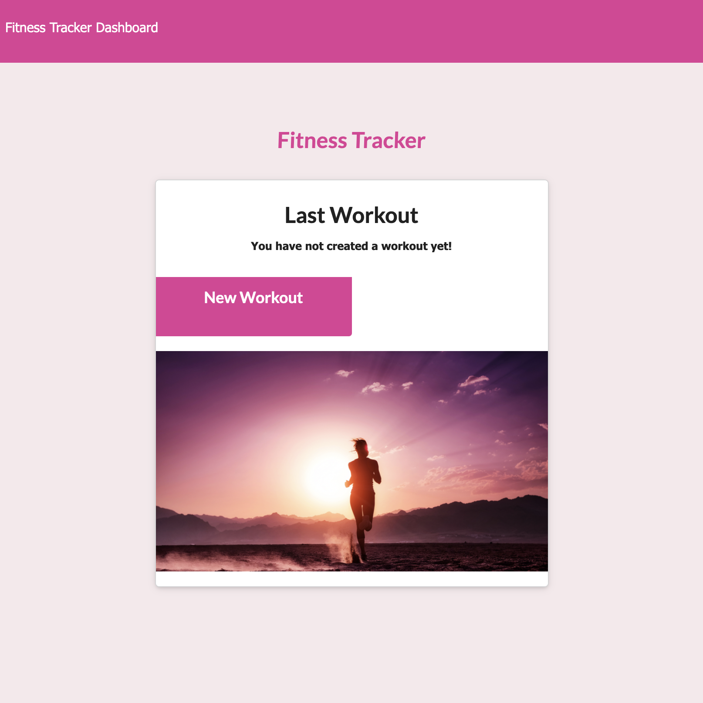
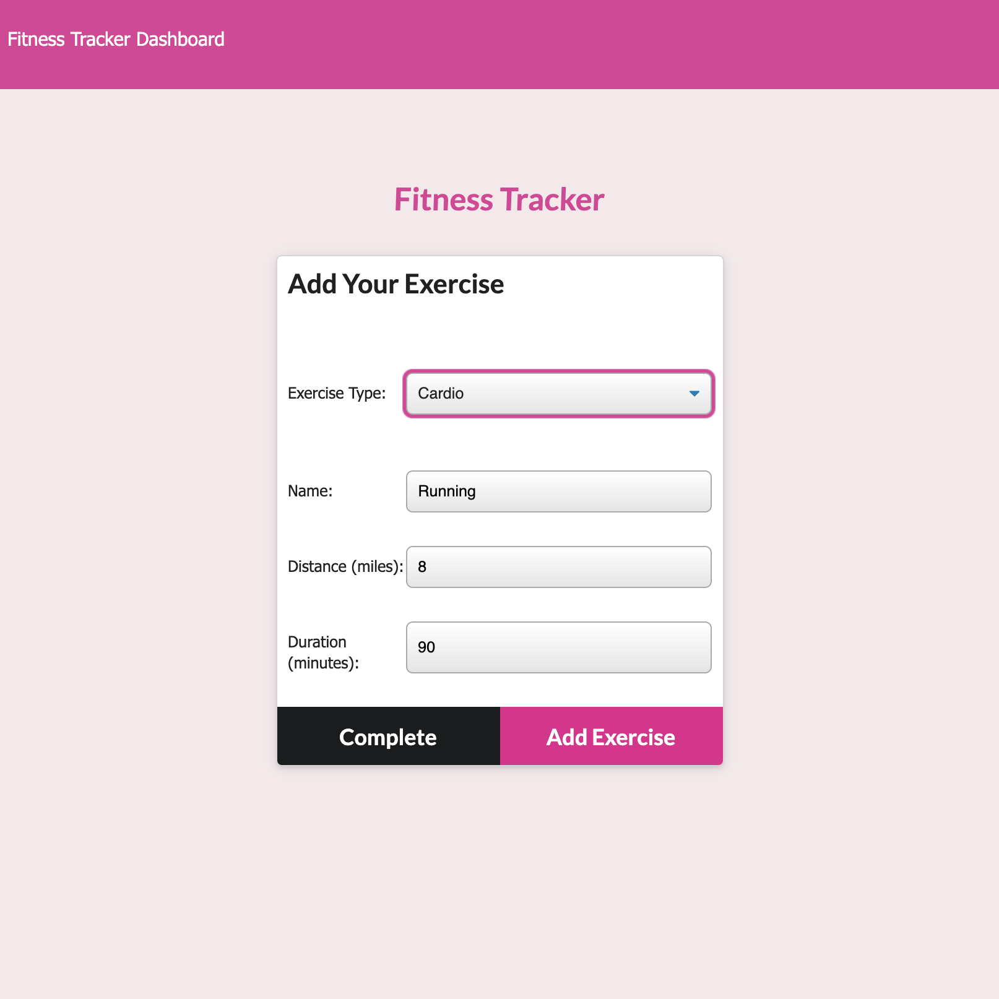
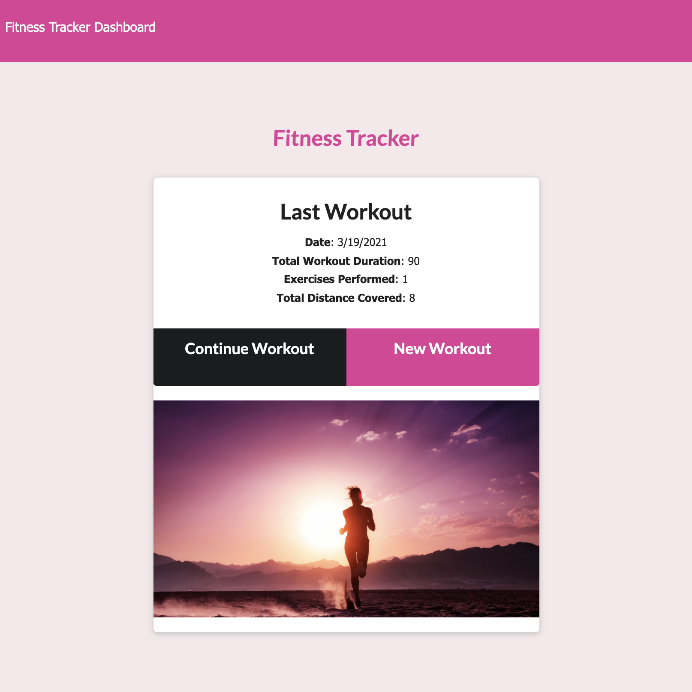
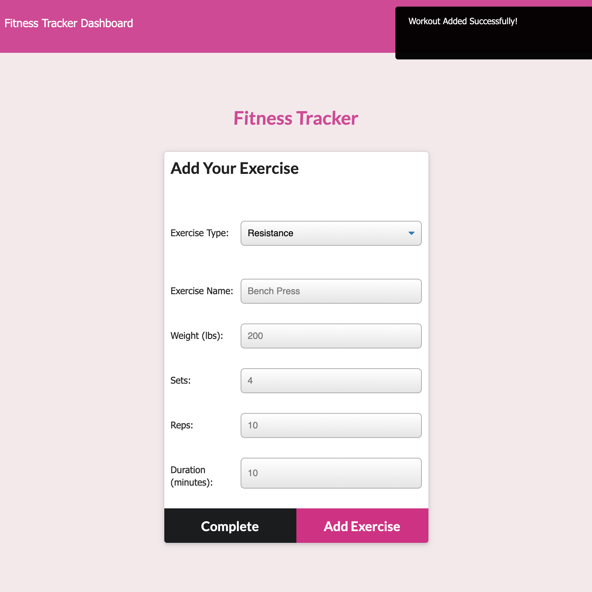
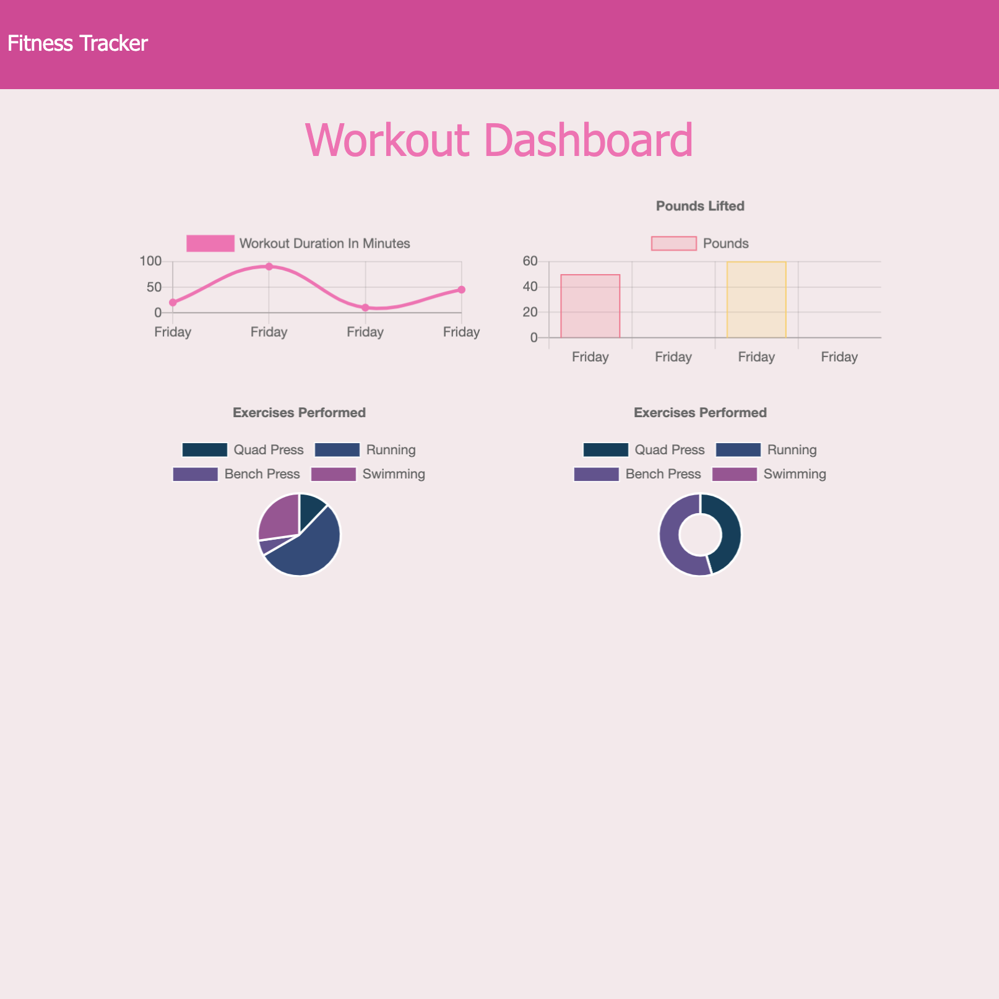

# workout-tracker
A workout tracker using a Mongo database with a Mongoose schema + routes with Express

           

## Project Links
[Repo Link](https://github.com/onomatopoetica/workout-tracker)  
**NOTE:** The deployed app can be found on [Heroku](https://immense-inlet-26212.herokuapp.com/). Please see the **Getting Started** section for more information regarding installation, usage, contribution guidelines, and where to go for questions.
    
## Table of Contents
1. [About The Project](#About-The-Project)
1. [Project Links](#Project-Links)
1. [Demo](#Demo)
1. [Getting Started](#Getting-Started)
1. [Installation](#Installation)
1. [Usage](#Usage)
1. [Contribution Guidelines](#Contribution-Guidelines)
1. [Questions](#Questions)
1. [Project Status](#Project-Status)
1. [License](#License)

## About The Project

It has been empirically proven people reach their fitness goals more quickly when they track their workout progress. With this app, the user can:

* View, create and track daily workouts. 

* Multiple exercises in a workout on a given day may be created. 

* The user can track the name, type weight, sets, reps and duration of an exercise.

* If the exercise is cardio, the user can track their distance traveled. 

Upon launching the app, the Workout Tracker gives the user the option to create a new workout or continue with their last workout. The user is able to:

* Add exercises to the most recent workout plan.

* Add new exercises to a new workout plan.

* View the combined weight of multiple exercises from the past seven workouts on the stats page.

* View the total duration of each workout from the past seven workouts on the stats page.

Because this application cannot be deployed on GitHub, a walkthrough video demonstrates its functionality below. The deployed app can be found on [Heroku](https://immense-inlet-26212.herokuapp.com/).

## Demo

#### The following is an overview of the application in operation and rendering of the Workout Tracker app. 
    
 

#### The following are screenshots of the application and overview of its functionality:  

  

## Getting Started
    
#### The following technologies used in this project include:
* MongoDB
* Mongoose 
* Node
* Express
* Morgan
    
## Installation: 
 
* Clone the repo: `git clone - https://github.com/onomatopoetica/workout-tracker.git`

#### After cloning the repo:

* All NPM packages required for this application (Express, Mongoose, and Morgan) are already listed as dependencies in the `package.json` file. Run the command 'npm i' command in your terminal at the root directory level to install the packages.

* The application will be invoked by using `nodemon` or entering `node server.js` in the command line. 

* You will see `App running on port 3000!` in the console. You can then view the app on http://localhost:3000/.
  
## Usage 

* See About The Project or demo video above for more information on how it works.
* View Project Links above for the link to the deployed app on Heroku.

## Contribution Guidelines

* When contributing to this repository, please contact the project team for review of your contribution plan. See contact details below.

### Return to [Table of Contents](#Table-of-Contents)

## Questions 
#### Connect with me:  

#### [Onomatopoetica](https://github.com/onomatopoetica)  
   

    
Contact

    jendotb@gmail.com

 

## Project Status

    
Current Project Activity

    Active

 
    
## License
#### Distributed under the MIT License. See `LICENSE` for more information.

##### This README was generated with :hearts:&nbsp; by [Good README Generator](https://github.com/onomatopoetica/Good-README-Generator).